<p align="center">
  
</p>

<p align="center">
  <strong>Open-source adversary emulation for AI agents, LLM apps, and MCP servers.</strong><br/>
  Test your AI like a real attacker would — from your CLI, your IDE, or a browser extension that anyone on your team can use.
</p>

<p align="center">
  <a href="LICENSE"></a>
  <a href="https://github.com/KeyValueSoftwareSystems/agent-opfor/stargazers"></a>
  <a href="https://discord.gg/DsJ6qm3V"></a>
  <a href="#evaluator-coverage"></a>
</p>

<p align="center">
  <a href="https://agentopfor.ai/">Website</a> ·
  <a href="https://docs.agentopfor.ai">Docs</a> ·
  <a href="https://github.com/KeyValueSoftwareSystems/agent-opfor">GitHub</a> ·
  <a href="https://chromewebstore.google.com/detail/blkflfeicejfnbecanjaolbllmoobenp">Browser Extension</a> ·
  <a href="https://discord.gg/DsJ6qm3V">Discord</a>
</p>

OPFOR is short for _Opposition Force_ — a military term for the unit that plays the enemy in training, so the rest of the army learns what real attacks feel like before they come. We named the tool after that idea: to defend AI agents better, you have to attack them first.

<p align="center">
  
</p>

## Why we built this

We've shipped 130 products for 90 startups over the last ten years. In the last 18 months, almost every one of them had an AI agent in it — and every one of those teams hit the same wall when it came to testing.

So we built OPFOR. For ourselves first. Now open source.

Apache 2.0. Built from India.

## Quick Start

```bash
npm install -g @agent-opfor/cli
export OPENAI_API_KEY=your-key    # or GEMINI_API_KEY, ANTHROPIC_API_KEY, etc.
```

**One-shot** — runs the setup wizard and immediately starts the scan:

```bash
opfor run
```

**Two-step** — save a config you can reuse or commit to CI:

```bash
opfor setup                               # wizard saves a config to .opfor/configs/
opfor run --config .opfor/configs/<file>  # run any time against the saved config
```

https://github.com/user-attachments/assets/a6a3cff2-2cf9-4486-944e-ac0163e7ea04

## What opfor does

Opfor red-teams the full AI agent surface — prompts, tools, MCP servers, memory, and multi-turn reasoning. It generates targeted attacks for OWASP LLM Top 10, OWASP Agentic AI Top 10, OWASP MCP Top 10, OWASP API Security, and EU AI Act bias suites, fires them at your target, and judges each response with an LLM.

Most red-team tooling in this space is excellent at one thing — a probe library, a developer evaluator, a programmatic framework. Opfor covers more ground in one tool:

- **Browser extension for non-developers** — anyone on your team can red-team a deployed chatbot, no code, no env vars, no YAML
- **Run opfor as an MCP server** — let your AI coding agent in Cursor or Claude Desktop red-team your other agents through natural language
- **Full OWASP coverage in one tool** — LLM Top 10, Agentic AI Top 10, MCP Top 10, API Security Top 10
- **No black box** — every attack prompt, request, response, and judge verdict is logged; reproducible, auditable, forkable
- **Built for agents, not just models** — designed for tool calls, MCP, memory, and multi-turn state from day one
- **Trace-aware** — integrates with Langfuse and Netra so the LLM judge sees what your agent did internally, not just what it said

## Five ways to run opfor

Different people on your team need different entry points. Opfor ships five.

| Mode                     | How                                                                     | Best for                                                                                  |
| ------------------------ | ----------------------------------------------------------------------- | ----------------------------------------------------------------------------------------- |
| 🖥️ **CLI**               | `opfor setup` → `opfor run`                                             | Engineers, CI/CD, terminal-first workflows                                                |
| 🌐 **Browser extension** | Install the extension, click the icon on any chat interface             | Product managers, designers, QA, security analysts — anyone who can't or won't write code |
| 🤖 **MCP server**        | Register opfor in Cursor or Claude Desktop, then ask in chat            | AI coding agents that test your other agents                                              |
| ⚡ **Skills**            | `/opfor-setup` · `/opfor-run` · `/opfor-mcp-setup` · `/opfor-mcp-run`   | Developers who want one-command testing inside their IDE                                  |
| 📦 **SDK**               | `npm install @agent-opfor/sdk`, then call `run` / `hunt` from your code | Programmatic red-teaming and custom workflows                                             |

All five share the same evaluators, attack templates, and judge logic.

→ [CLI reference](docs/cli.md) · [Browser extension setup](docs/browser-extension.md) · [MCP setup](docs/mcp.md) · [Skills setup](docs/skills.md) · [SDK reference](docs/sdk.md)

## How it works

<p align="center">
  
</p>

When you run a scan, opfor:

1. **Fetches target info** — connects to your agent, detects available tools, MCP endpoints, capabilities
2. **Plans attacks per category** — generates targeted prompts for each evaluator in your selected suite
3. **Emulates the attack** — runs multi-turn adversarial conversations (real requests, real responses)
4. **Evaluates with a judge** — an LLM judge classifies each response with pass/fail + reasoning
5. **Generates a report** — HTML for browsing, JSON for CI/CD, all artifacts logged for reproducibility

Each run lands in its own subfolder under `.opfor/reports/run-report-<compactTs>-<slug>-<shortId>/` containing `<slug>-report.html` and `<slug>-report.json`. Autonomous `opfor hunt` runs use the same layout under `hunt-report-<compactTs>-<slug>-<shortId>/`.

## Evaluator coverage

Opfor ships with curated suites that map to industry standards. Pick a suite or run individual evaluators.

| Suite ID           | Standard                  | Focus                                                                     |
| ------------------ | ------------------------- | ------------------------------------------------------------------------- |
| `owasp-llm-top10`  | OWASP LLM Top 10 (2025)   | Prompt injection, jailbreaks, sensitive disclosure, system prompt leakage |
| `owasp-agentic-ai` | OWASP Agentic AI Top 10   | Excessive agency, tool misuse, agent goal hijack, memory poisoning        |
| `owasp-mcp-top10`  | OWASP MCP Top 10 (2025)   | Secret exposure, scope escalation, tool description injection, SSRF       |
| `owasp-api`        | OWASP API Security Top 10 | BOLA, BFLA, SQL injection                                                 |
| `eu-ai-act-bias`   | EU AI Act — Bias          | Age, gender, race, disability                                             |

→ [Full evaluator reference and OWASP mapping](docs/evaluators.md)

## Trace-aware testing

Plug opfor into your observability stack and the LLM judge sees not just the final response — but every tool call, retrieval, and intermediate reasoning step. Out of the box, opfor integrates with **[Langfuse](https://langfuse.com)** and **[Netra](https://getnetra.ai)**.

```json
"telemetry": {
  "provider": "langfuse",
  "langfuse": { "baseUrl": "https://cloud.langfuse.com" }
}
```

This catches what input/output testing misses — PII that leaks into a tool call but never reaches the user, scope escalations in MCP that don't change the response text, agents that retrieve unauthorized data but render a clean reply.

→ [Trace-aware testing guide](docs/telemetry.md)

## Autonomous Red-Teaming

`opfor hunt` skips the config file entirely. Give it an endpoint and an objective, and a multi-agent system — commander, operators, scout — runs an adaptive attack campaign on its own: recon, strategy, multi-turn probing, report.

```bash
opfor hunt \
  --endpoint "https://your-agent.com/v1/chat" \
  --objective "Find jailbreaks, system-prompt leakage, and safety bypasses."
```

Add `--ui` to watch the attack tree unfold in a live dashboard.

→ [Full reference](docs/hunt.md)

## Browser extension — red-team a chatbot

The browser extension is opfor's no-code path. Install from the Chrome Web Store, open any chat interface, click the opfor icon, pick a suite, and watch it run.

https://github.com/user-attachments/assets/80c2692f-b18b-4899-99df-e7eb8d50b02a

It auto-detects the chat interface, sends attack prompts as if you were typing them, watches the responses, and downloads an HTML report when done. No CLI, no target setup, no YAML.

This is the path for the half of every product team that doesn't open a terminal.

→ [Install from the Chrome Web Store](https://chromewebstore.google.com/detail/blkflfeicejfnbecanjaolbllmoobenp) · [Setup guide](docs/browser-extension.md)

## SDK — embed red-teaming in your code

The SDK is opfor's programmatic path. Install `@agent-opfor/sdk`, call `run` or `hunt`, and get structured results back — no CLI, no config files, no subprocess.

```typescript
import { Opfor } from "@agent-opfor/sdk";

const opfor = new Opfor({ apiKey: process.env.ANTHROPIC_API_KEY });

const results = await opfor.run({
  target: { url: "https://api.example.com/chat" },
  suite: "owasp-llm-top10",
});
```

Use it in CI, in test suites, or anywhere you need red-teaming without leaving TypeScript.

→ [SDK reference](docs/sdk.md)

## Examples

| Example                                               | Description                                                     |
| ----------------------------------------------------- | --------------------------------------------------------------- |
| [vanilla-chat](tests/e2e/agents/vanilla-chat)         | Plain customer support chatbot — test LLM-level vulnerabilities |
| [customer-support](tests/e2e/agents/customer-support) | Tool-calling agent with PostgreSQL — test BOLA, BFLA, RBAC, PII |
| [vulnerable-server](tests/e2e/mcp/vulnerable-server)  | Sample MCP server with intentional vulnerabilities              |

## Supported LLM providers

| Provider          | Env var                        | Default model                      |
| ----------------- | ------------------------------ | ---------------------------------- |
| Groq              | `GROQ_API_KEY`                 | `llama-3.3-70b-versatile`          |
| OpenAI            | `OPENAI_API_KEY`               | `gpt-4o-mini`                      |
| Anthropic         | `ANTHROPIC_API_KEY`            | `claude-3-5-haiku-20241022`        |
| Google            | `GOOGLE_GENERATIVE_AI_API_KEY` | `gemini-2.0-flash`                 |
| OpenAI-compatible | `OPFOR_API_KEY` + `baseURL`    | LiteLLM, OpenRouter, Azure, Ollama |

## Contributing

Please read [CONTRIBUTING.md](CONTRIBUTING.md) for details on our code of conduct, and the process for submitting pull requests to us.

&nbsp;

## Authors

Built by the team at [KeyValue Software Systems](https://keyvalue.systems). Contact [contact@agentopfor.ai](mailto:contact@agentopfor.ai) for all enquiries.

&nbsp;

## Security

Use opfor only on systems you own or are authorized to test. To report a vulnerability in opfor itself, see [SECURITY.md](SECURITY.md) — do not open a public issue.

&nbsp;

## License

Opfor is licensed under Apache 2.0 — see the [LICENSE](LICENSE) file for details.

---

<p align="center">
  Built with ❤️ by <a href="https://keyvalue.systems">KeyValue</a>
</p>
