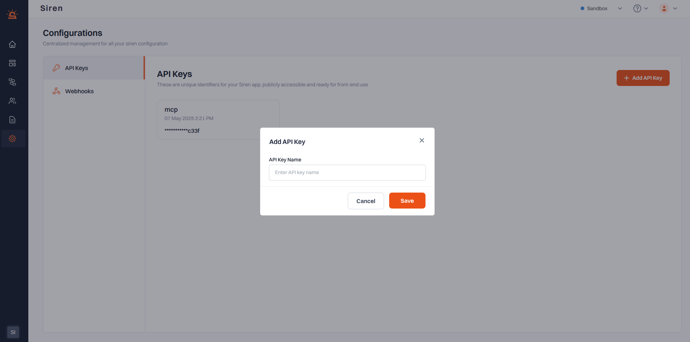
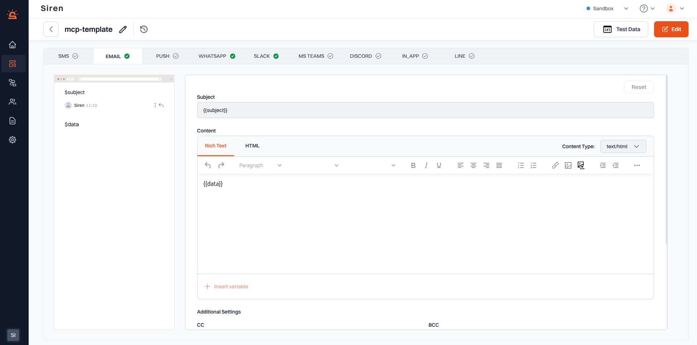
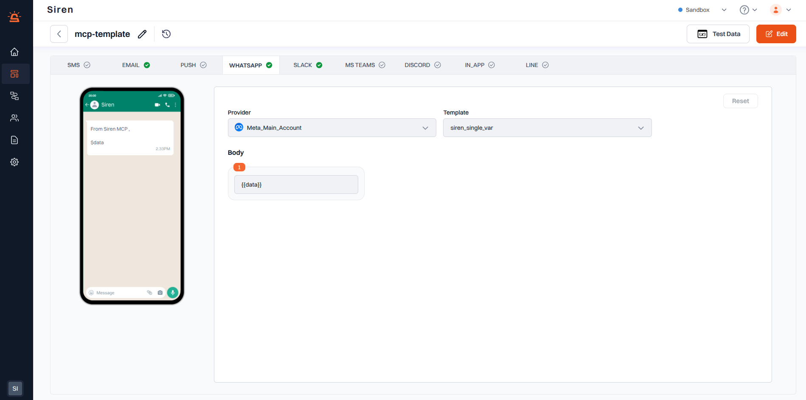
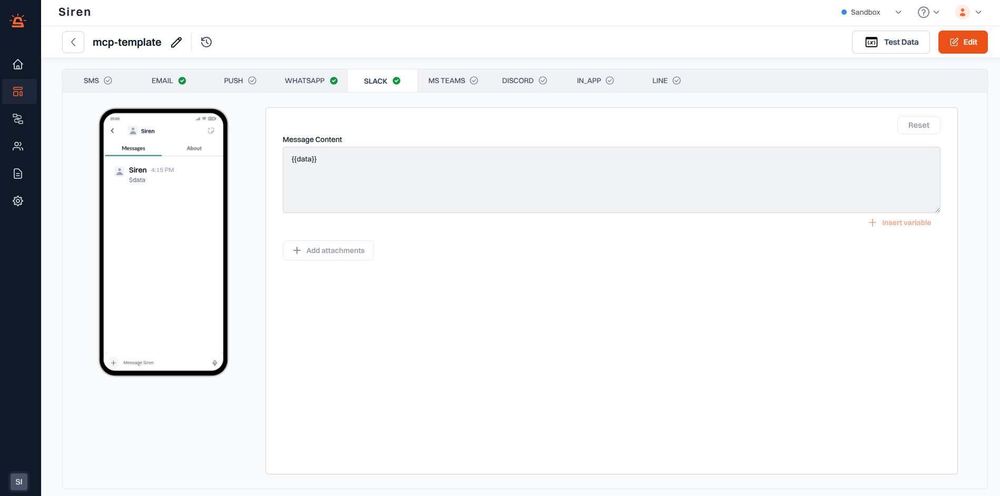

# Siren MCP Server

The **Siren MCP Server** is a Model Context Protocol (MCP) server built to interface with the [Siren platform](https://dev.trysiren.io/). It allows seamless integration of messaging channels like Email, WhatsApp, and Slack with LLM agents such as Claude, Windsurf, and others.

---

## Features

- Multi-channel notification support (Email, WhatsApp, Slack)
- Integration with LLM agents

---

## Setup Guide

Follow the steps below to configure and run the Siren MCP server.

---

### 1. Create a Siren Account

- Go to [Siren](https://dev.trysiren.io/) and create an account.

---

### 2. Generate an API Key

- Once logged in, navigate to the **Settings > Configuration** tab.
- Click on **API Keys** and generate a new API key.
- Copy and save the API key — this will be used in your MCP configuration.



---

### 3. Configure Providers for Channels

#### 3.1 WhatsApp

- Navigate to the **Settings > Providers** tab.
- Choose a WhatsApp provider (Meta).
- Integrate your WhatsApp Business account.

<!--  -->

#### 3.2 Email

- In the same **Providers** section, add a provider for email (Gmail).

<!--  -->

#### 3.3 Slack

- Add your Slack app as a provider.

<!--  -->

---

### 4. Create Templates for Each Channel

Templates help structure outgoing messages. Each template will require variables to be defined.

#### 4.1 Email

- Go to the **Templates** section in Siren.
- Create a new template.
- Add variables: `{{subject}}`, `{{data}}`.

<!--  -->


#### 4.2 WhatsApp

- Select the provider.
- Select the template from your Meta account.
- Add the `{{data}}` variable in the content.



#### 4.3 Slack

- In the content section, include the `{{data}}` variable.

<!--   -->


📝 **Note**: Template has a unique ID. Keep this ID handy, as it’s needed in the config step.

---

### 5. Clone and Configure MCP Server

Clone the repo:

```bash
git clone https://github.com/KeyValueSoftwareSystems/Siren-MCP.git
cd Siren-MCP
```

Install dependencies:

```bash
npm install
```

Build the MCP Server

```bash
npm run build
```
